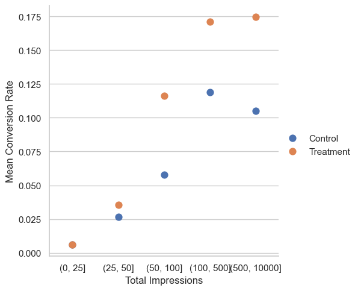
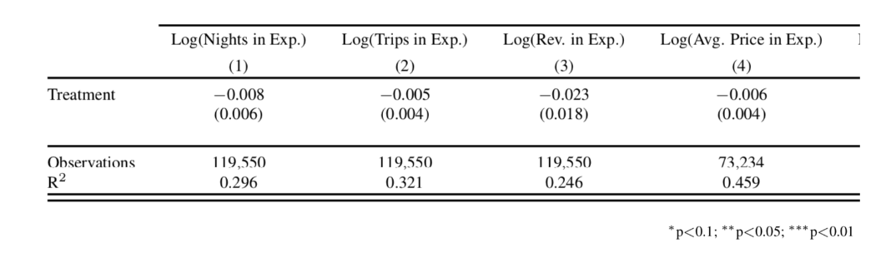

Practice Exam

1. Suppose we are Tesla and operate dealerships (stores) which sell cars. We want to try something new at some of the dealerships: providing comparative test drives of competitor cars. For example, we would let customers drive a Tesla as well as an Audi to see how they compare. We are going to run a randomized experiment at the dealership level. Using bullet points, describe the pros and cons of:
   - Clustering the assignment so that all dealerships in the same metro area are assigned to either treatment or control. (6 points)
   - Balancing the assignment within metro areas (i.e., blocking or stratified randomization within metro area) so that the same fraction (up to rounding) of dealerships in each metro area are assigned to treatment. (6 points)

**Answer:**

    - Reduces problems with interference, less statistical power.
    - More statistical power. Interference is a concern.


2. Consider the setting of Lewis and Rao (2015), which studied the possibility of measuring the returns on investment to advertising using data from advertisers on Yahoo.
   - Explain why precisely measuring the returns to advertising is more difficult than measuring the effect of advertising on conversion. Note: conversion is a binary variable that takes the value of 1 when a consumer makes a purchase and 0 otherwise. (6 points)
  
**Answer:**

```
The returns to advertising is harder to measure than the effect of advertising on conversion because in order to compute ROI you need to know the effect of advertising on sales. The variance of sales is greater than the variance of conversions, making the estimator more imprecise. 
```


 
- Suppose you have a data set of outcomes at an individual level and the treatment is whether you saw an ad. The first few rows of the dataset (file = ads.csv) looks as follows:
 
| fullname           | sales ($) | location      | conversion | num_items_purchased | treatment |
|--------------------|-------|---------------|------------|---------------------|-----------|
| Daenerys Targaryen | 52    | King’s Landing | 1          | 1                   | 0         |
| Jon Snow           | 54    | Winterfell    | 1          | 5                   | 1         |
| Sandor Clegane     | 66    | King’s Landing | 1          | 1                   | 1         |
| Tyrion Lannister   | 79    | Winterfell    | 1          | 2                   | 1         |
| Cersei Lannister   | 68    | King’s Landing | 1          | 3                   | 1         |
| Arya Stark         | 59    | Winterfell    | 1          | 2                   | 0         |
| Sansa Stark        | 0     | Winterfell    | 0          | 0                   | 1         |


 
Consider the line of code below:
``` 
import numpy as np
import pandas as pd
import seaborn as sns

# read data
ads_data = pd.read_csv('ads.csv')

ads_data.groupby('location').agg(click_rate=('conversion', 'mean'))
```
	
Please write out what the output of those lines will look like if the dataset had just the rows you see above. (6 points)

**Answer**

| location          | click_rate |
|-------------------|------------|
| Winterfell     | 0.75       |
| King’s landing | 1          |
`


c.     Please create a column (using Python) that contains the average price per item for each person. (6 points)

**Answer:**
```
ads_data['avg_price_per_item'] = ads_data['sales ($)'] / ads_data['num_items_purchased']
```

d.    Suppose that treatment were randomly assigned, please use Python to calculate the $\hat{ATE}$ on sales. (6 points)

**Answer:**
```
treatment_group_sales = ads_data[ads_data['treatment'] == 1]['sales ($)'].mean()
control_group_sales = ads_data[ads_data['treatment'] == 0]['sales ($)'].mean()
ate_on_sales = treatment_group_sales - control_group_sales
```

 
e.     Consider the following regression of sales on treatment, and conversion, where i refers to an individual and i is the residual.

$Sales_i = b_0 + b_1*treatment_i + b_2*conversion_i + b_3*location_i + ε_i$

Write out the Python code that generates this regression using your knowledge of the regression function in Python and the data set above. (6 points)

**Answer:**
```
import statsmodels.formula.api as smf
ads_data['sales'] = ads_data['sales ($)']

# Define the model using formula notation
model_formula = 'sales ~ treatment + conversion + location'

# Fit the model
model = smf.ols(formula=model_formula, data=ads_data).fit(cov_type='HC1')

# Print the summary of the model with robust standard errors
print(model.summary())
```
 
f.      Are any of the covariates in the above regression ‘bad’ (meaning bad controls)? If so, which ones and why? (6 points)
 
**Answer:**
```
Yes, the covariate ‘conversion’ is a bad control. The reason is that the treatment affects not only sales but also conversions. Conditioning on conversions absorbs part of the effect of the treatment, making the coefficient on treatment biased.

```

g.    Suggest a way to run a balance/randomization check using the above data and describe the exact procedure in steps by which you would reject the null hypothesis of valid randomization. (6 points)

**Answer:**
```
Run a regression of location on treatment status. If the p-value of the coefficient on treatment is less than or equal to .05, reject the null of proper randomization.
```

1. Questions about the Rocketfuel case.

   - The ad campaign used a public service announcement (PSA) as a control group. Select each of the advantages of using a public service announcement. (6 points)
       - [ ] The public service announcement increases statistical power.
       - [x] The public service announcement allows us to identify who would have seen our ad if they were in the treatment group.
       - [ ] The public service announcement correctly represents what would happen if Taskabella didn’t run the campaign.
       - [ ] None of the above.

   - Consider the figure below. Which of the statements below is something that we can learn from the figure? (6 points)
       - [ ] More impressions cause more conversions.
       - [ ] Seeing the advertisement 50 - 100 times causes a higher rate of conversion than seeing the ad 25 - 50 times. 
       - [ ] The PSA control increased purchase rates.
       - [x] None of the above.

	
   -

Select all of the proposed experimental designs below that are valid. (6 points)

- [ ] Users with more than 100 impressions are shown the ad and users with fewer than 100 impressions are shown the PSA.
- [ ] Users arriving on the website on Tuesdays and Mondays are shown the ad while users arriving on the website on Wednesday through Sunday are shown the control.
- [x] Users randomly assigned to the treatment see ads only if they arrive to the website in the evening. Users randomly assigned to the control see ads whenever they land on the website.
- [ ] None of the above.


4. Consider the regression table below, where the outcomes are host related variables in the reviews experiment. 

	


	- Is the coefficient on Treatment in column 2 statistically significant? (6 points)


        **Answer: No, no stars.**


	- What is the 95% confidence interval on this coefficient (Column 2). You can write out the formula for the confidence interval without calculating it. (6 points)
  
   **Answer:** (-.005 - 1.96*.004, -.005 + 1.96*.004) 


5. Many programs strive to help students prepare for college entrance exams, such as the SAT. In an effort to study the effectiveness of these preparatory programs, a researcher draws a random sample of students attending public school in the US, and compares the SAT scores of those who took a preparatory class to those who did not. The researcher finds that students who enroll in these programs have worse SAT scores than those who do not enroll. Is this an experiment or an observational study? If you think it is an observational study, tell a concrete story about why selection bias might explain these differences between those who did and did not enroll. If you think it is an experiment, explain what potential problems the experiment overcomes.


    **Answer: This is an observational study. Selection bias may occur because those who enroll in a preparatory class may differ in academic aptitude or motivation from those who do not. Alternatively, there may be non-profit programs that enroll students into SAT prep classes. Any of these factors may independently affect SAT scores, thus creating selection bias.** 